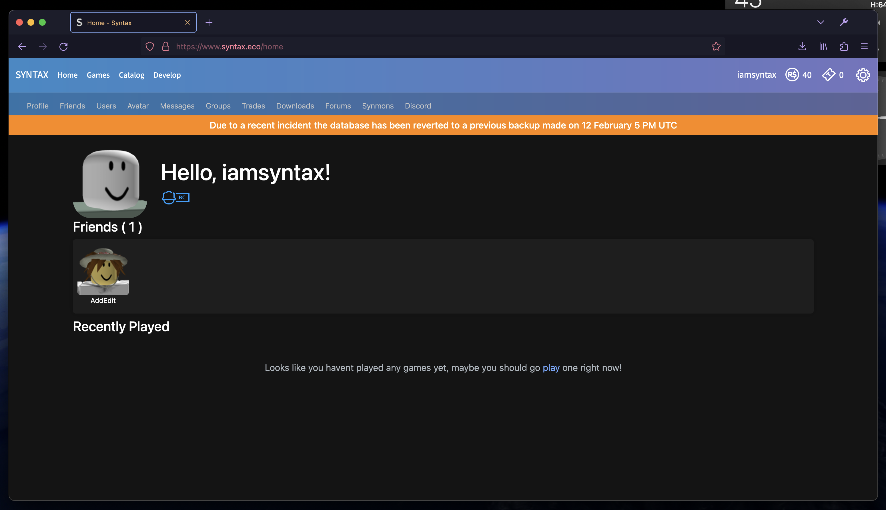

# FINTAX
## Nostalgically bland

### How to apply
- Copy and paste [this CSS](./Fintax%20-%20Top.css) into [Stylus](https://github.com/openstyles/stylus) or another userstyle extension
    - If promped, click `Overwrite Style` button after pasting

### Showcase
- Just top

- With finobe css

### Notes
- This is absolute shit coding at best, I hate css.